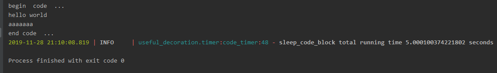

.. _code_timer:

.. 如何使用一个方法 来计算一个代码段的时间

code_timer 模块介绍
=====================
这个里使用了一个上下文管理器,来实现计算 一段 代码段执行时间

举个例子
------------

.. code-block:: python

    import time
    from useful_decoration.timer import code_timer

    def get_token():
        print("begin  code  ... ")
        with code_timer("sleep_code_block"):
            print("hello world")
            time.sleep(5)
            print("aaaaaaa")

        print("end code  ... ")

    if __name__ == '__main__':
        get_token()

..

结果如下:

结果可以看出 被code_timer 的代码段的时间.

